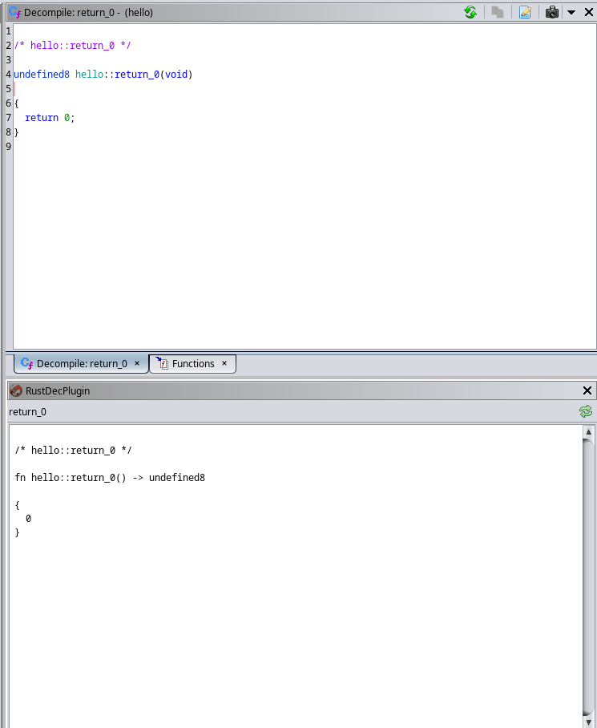

<p align="center">
  
  <h1 align="center">GhidRust</h1>
  <p align="center">GhidRust: Rust binary analysis extension for Ghidra</p>
</p>

**Status:** Currently, the plugin is under extensive development. It is far from maturity. But a working prototype can be expected within a few weeks.


This project was a part of one of my institute courses. For a detailed overview, please have a look at the [report](./media/report.pdf) created for the course submission. The following README is fairly sparse.

## Features

### Rust binary detection

The plugin can detect Rust binaries. To use the feature, click on `GhidRust -> Check if Rust binary`. It will show a popup indicating whether it's a Rust binary or not.

May not be a Rust binary   |  May be a Rust binary
:-------------------------:|:-------------------------:
   |  

### Function ID

The plugin also consists of `RustStdAnalyzer` which analyzes Rust binaries and applies function signatures to the library functions (Rust's `std`) found in the binary. This is done using `.fidb` function ID database. A default database for x86-64 and Rust version 1.58.1 has been provided at [`libstd.fidb`](./data/libstd-4c74cbab78ec4891.fidb). This is useful when analyzing stripped Rust binaries.

Without Function ID        |  With Function ID
:-------------------------:|:-------------------------:
   |  

The analyzer is enabled by default for Rust binaries, and it's name in analyzer window is _"Detect Rust libstd functions"_.


### Decompilation

This is a work-in-progress feature as of now. It requires parsing the decompiled C code and then emitting the corresponding Rust code. Once that is done, Rust macro support will also be added in the future.

The decompiler panel can be accessed by clicking `GhidRust -> Open decompiler`. It looks as follows.



## Building

There is a build script provided (`build.sh`) which can build and install the extension.

```
$ ./build.sh -h
GhidRust install script
Usage: build.sh [-i | --install] -g GHIDRA_PATH

        -i | --install           Install the extension
        -g | --ghidra            Path to Ghidra installation (usually /opt/ghidra)
        -h | --help              Show usage/help
```

You can build the extension using the following command.

```
$ ./build.sh -g <GHIDRA_INSTALL_DIR>
```

You can install it using the install flag as follows.

```
./build.sh -ig <GHIDRA_INSTALL_DIR>
```

## Adding it to Ghidra

To add it to Ghidra, just click on `File -> Install Extensions...` and choose GhidRust there. Once installed, you will have a `GhidRust` entry in the Ghidra toolbar which can be used to invoke the plugin.

You might need to activate it from the `File -> Configure...` menu. Choose the `Miscellaneous` section, and click the checkbox beside _RustDecPlugin_.
